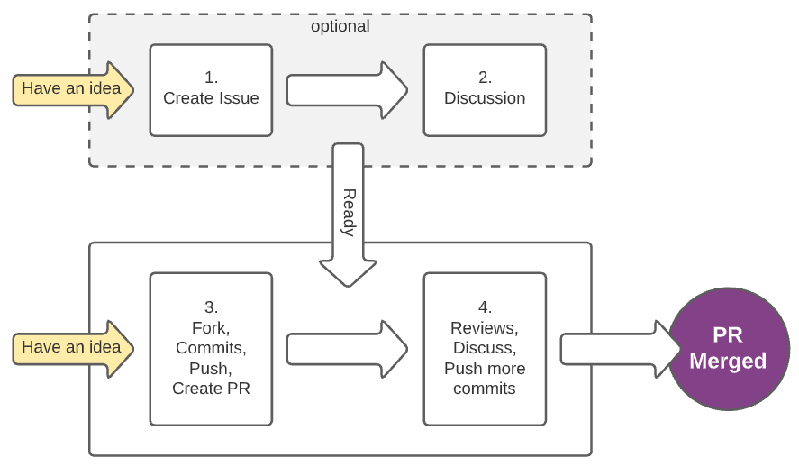

# Contributing

Welcome to Cloud Secret Resolvers (CSR) project. Contributions to the project are always very welcome! 🙏🏽  

## Licensing

This repository is under the same license as MIT. You can find the full text of the license in the `LICENSE` files in this repository.

## Submitting a pull request
One PR should contain only 
- one feature 
- fixed bugs 
- refactor 

so the reviewer can focus only on list above, also this will keep PR in a reasonable size to review.

## Commit message
For the commit message, use the following format: [Conventional Commits](https://www.conventionalcommits.org/en/v1.0.0/#specification)

## How to contribute



### 1. Create an Issue
[Create a new issue](https://github.com/kubeopsskills/cloud-secret-resolvers/issues/new). Please describe details of what you want to do. You can see [our previous issues](https://github.com/kubeopsskills/cloud-secret-resolvers/issues) as examples. Create an issue is easy; make it simple. When you have an idea, create it. It does not need to be perfect from the start.

### 2. Make a Discussion
Let you, the admin team, and other members a chance to make conversation on the issue topic:

  - Discuss solutions and alternatives. Two heads are better than one.
  - From the discussion, we may prevent duplicate or unnecessary works that save your valuable time later.
  - Ask any questions that you want people to help.
  - Let people know in advance what you are going to do is always a good idea.

Once things ready, set `Assignees` to a member who wishes to work on the issue. It can be either the issue's creator or anyone else. And you can remove `help wanted` label, if any.

> These first two steps are not required in all scenarios, but we encourage you because more collaboration makes things better and more enjoyable.✨

### 3. Open a Pull Request
- Fork this repository to your own GitHub account and then clone it to your local machine.
- Setup your [GPG sign](https://docs.github.com/en/authentication/managing-commit-signature-verification/about-commit-signature-verification) for commit signature verification
- Create a new branch, name it to what you are going to change/add. Please use `kebab-case` naming.
  ```sh
  git checkout -b your-branch-name
  ```
- Start your work
- Run Unit Test
  ```sh
  make test
  ```
- Commit your code
- Push your changes to your origin.
  ```sh
  git push origin -u your-branch-name
  ```

- Create a new Pull Request (PR) targeting the `main` branch of `cloud-secret-resolvers`

### 4. Review and Complete the Work
- Waiting for reviewing. Push more commits if needed to fix your work from pull request feedback. 
  ```sh
  git push
  ```
- A pull request needs at least one careful approval before anyone can merge to `main` branch. Then it will automatically deploy to the server.