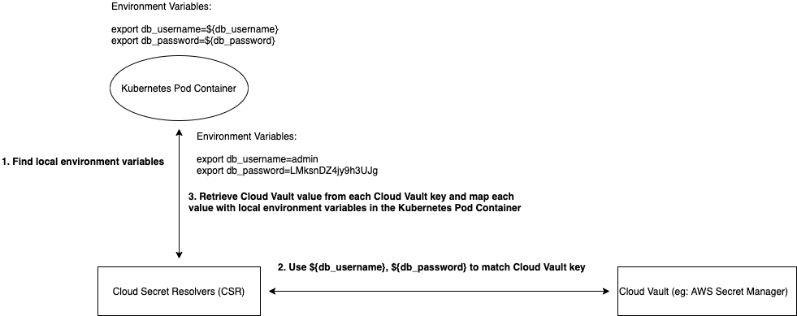

[](https://codecov.io/gh/kubeopsskills/cloud-secret-resolvers)
[](https://github.com/kubeopsskills/cloud-secret-resolvers/releases)
[](https://github.com/kubeopsskills/cloud-secret-resolvers/blob/main/LICENSE)
[](https://github.com/kubeopsskills/cloud-secret-resolvers/releases)
<!-- ALL-CONTRIBUTORS-BADGE:START - Do not remove or modify this section -->
[](#contributors-)
<!-- ALL-CONTRIBUTORS-BADGE:END -->
# Cloud Secret Resolvers (CSR)

Cloud Secret Resolvers is a set of tools to help your applications (on Kubernetes) to retrieve any credentials from cloud managed vaults without the needed to write additional boilerplate code in your applications!

<!-- TOC -->

- [Cloud Secret Resolvers (CSR)](#cloud-secret-resolvers-csr)
  - [Installation](#installation)
  - [Using on Kubernetes](#using-on-kubernetes)
  - [How it works](#how-it-works)
  - [Development](#development)
  - [Contribution](#contributing)
  - [Reporting issues and feedback](#reporting-issues-and-feedback)
  - [Contributors ✨](#contributors-)

<!-- /TOC -->

## Installation

Cloud Secret Resolvers is available on Linux, ARM, macOS and Windows platforms.
- Binaries for Linux, ARM, Windows and Mac are available as tarballs in the [release](https://github.com/kubeopsskills/cloud-secret-resolvers/releases) page

## Using on Kubernetes

- AWS
  
  - Prerequisites:
    1. Enabled the OIDC provider on your [EKS](https://aws.amazon.com/th/eks/) cluster (https://docs.aws.amazon.com/eks/latest/userguide/enable-iam-roles-for-service-accounts.html)
    2. Your application Kubernetes pod has a service account with the following privillege:
       [policy.json](assets/policy.json)
  - Update your application entrypoint as follows:
    ```bash
    #!/bin/bash
    eval $(csr)
    node ... # your application runtime command
    ```
  - Update your application Kubernetes config maps as follows:
    ```yaml
    apiVersion: v1
    kind: ConfigMap
    metadata:
      name: [your config map name]
      namespace: [your config map namespace name]
    data:
    ...
    CLOUD_TYPE: "aws"
    AWS_REGION: "[your AWS region name]"
    AWS_SECRET_NAME: "[your AWS secret name]"
    ```

- Azure
  - Prerequisites:
    1. Create a managed identity for your Azure Key Vault (https://docs.microsoft.com/en-us/azure/active-directory/managed-identities-azure-resources/overview)
    2. Grant "Key Vault Reader" and "Key Vault Secrets User" RBAC roles to the managed identity (https://docs.microsoft.com/en-us/azure/key-vault/general/rbac-guide?tabs=azure-cli)
    3. Create an Azure Identity and an Azure Identity Binding on your AKS cluster to map the managed identity to your pods on the cluster for providing access to the Azure Key Vault (https://azure.github.io/aad-pod-identity/docs/demo/standard_walkthrough/)

  - Update your application entrypoint as follows:
    ```bash
    #!/bin/bash
    eval $(csr)
    node ... # your application runtime command
    ```
  - Update your application Kubernetes config maps as follows:
    ```yaml
    apiVersion: v1
    kind: ConfigMap
    metadata:
      name: [your config map name]
      namespace: [your config map namespace name]
    data:
    ...
    CLOUD_TYPE: "azure"
    AZ_VAULT_NAME: "[your Azure key vault name]"
    ```
  
- Google Cloud
  - Prerequisites:
    1. Enabled the Workload Identity on your [GKE](https://cloud.google.com/kubernetes-engine) cluster (https://cloud.google.com/kubernetes-engine/docs/how-to/workload-identity)
    2. Your application Kubernetes pod has a service account with Secret Manager Secret Accessor permission
  
  - Update your application entrypoint as follows:
    ```bash
    #!/bin/bash
    eval $(csr)
    node ... # your application runtime command
    ```
  - Update your application Kubernetes config maps as follows:
    ```yaml
    apiVersion: v1
    kind: ConfigMap
    metadata:
      name: [your config map name]
      namespace: [your config map namespace name]
    data:
    ...
    CLOUD_TYPE: "gcloud"
    GOOGLE_PROJECT_ID: "[your Google cloud project Id]"
    ```

- Hashicorp Vault
  - Prerequisites:
    1. Enabled Kubernetes Authentication on your Vault (https://www.vaultproject.io/docs/auth/kubernetes)
    2. Your application Kubernetes pod has a service account with Read Only permission to the Vault secret path
  
  - Update your application entrypoint as follows:
    ```bash
    #!/bin/bash
    eval $(csr)
    node ... # your application runtime command
    ```
  - Update your application Kubernetes config maps as follows:
    ```yaml
    apiVersion: v1
    kind: ConfigMap
    metadata:
      name: [your config map name]
      namespace: [your config map namespace name]
    data:
    ...
    CLOUD_TYPE: "vault"
    VAULT_ADDR: "[your vault addr]"
    VAULT_ROLE: "[your vault role]"
    VAULT_PATH: "[your vault secret path]"
    ```

## How it works
The architecture looks like below.

Internally, the `CSR` find local environment variables in the Kubernetes Pod Container which have Cloud Vault key placeholders for example: export db_username=${db_username}, then the `CSR` will extract db_username as a key and ${db_username} as a value. Finally, the `CSR` will use ${db_username} to match cloud vault key, retrieve cloud vault value, and map the value with db_username local environment.



## Development

We use make commands for these developer operations.

- `make run` for running CSR locally
- `make test` for testing CSR
- `make test-coverage` for export test coverage
- `make all` for building CSR binary for all OSes
- `make clean` for cleaning build for CSR binary

## Contributing

We'd love your help! Please see [CONTRIBUTING][contrib] to learn about the
kinds of contributions we're looking for.

## Todo

- We use [GitHub Issues][github-issue] to track our to do items.
- Please check the [following link][follow] if you would like to contribute to the project.

## Reporting issues and feedback

If you encounter any bugs with the tool please file an issue in the [Issues](https://github.com/kubeopsskills/cloud-secret-resolvers/issues) section of our GitHub repo.

[contrib]: ./CONTRIBUTING.md
[follow]: ./CONTRIBUTING.md
[github-issue]: https://github.com/kubeopsskills/cloud-secret-resolvers/issues/new

## Contributors ✨

Thanks goes to these wonderful people ([emoji key](https://allcontributors.org/docs/en/emoji-key)):

<!-- ALL-CONTRIBUTORS-LIST:START - Do not remove or modify this section -->
<!-- prettier-ignore-start -->
<!-- markdownlint-disable -->
<table>
  <tr>
    <td align="center"><a href="https://naijab.com"><br /><sub><b>Nattapon Pondongnok</b></sub></a><br /><a href="https://github.com/kubeopsskills/cloud-secret-resolvers/commits?author=naijab" title="Code">💻</a> <a href="https://github.com/kubeopsskills/cloud-secret-resolvers/commits?author=naijab" title="Tests">⚠️</a></td>
    <td align="center"><a href="https://kubeops.guru"><br /><sub><b>Saritrat Jirakulphondchai</b></sub></a><br /><a href="https://github.com/kubeopsskills/cloud-secret-resolvers/commits?author=Sikiryl" title="Code">💻</a> <a href="https://github.com/kubeopsskills/cloud-secret-resolvers/commits?author=Sikiryl" title="Tests">⚠️</a> <a href="https://github.com/kubeopsskills/cloud-secret-resolvers/pulls?q=is%3Apr+reviewed-by%3ASikiryl" title="Reviewed Pull Requests">👀</a></td>
    <td align="center"><a href="https://www.kubeops.guru"><br /><sub><b>Sirinat Paphatsirinatthi</b></sub></a><br /><a href="https://github.com/kubeopsskills/cloud-secret-resolvers/commits?author=dmakeroam" title="Code">💻</a> <a href="https://github.com/kubeopsskills/cloud-secret-resolvers/commits?author=dmakeroam" title="Tests">⚠️</a> <a href="https://github.com/kubeopsskills/cloud-secret-resolvers/pulls?q=is%3Apr+reviewed-by%3Admakeroam" title="Reviewed Pull Requests">👀</a></td>
  </tr>
</table>

<!-- markdownlint-restore -->
<!-- prettier-ignore-end -->

<!-- ALL-CONTRIBUTORS-LIST:END -->

This project follows the [all-contributors](https://github.com/all-contributors/all-contributors) specification. Contributions of any kind welcome!
